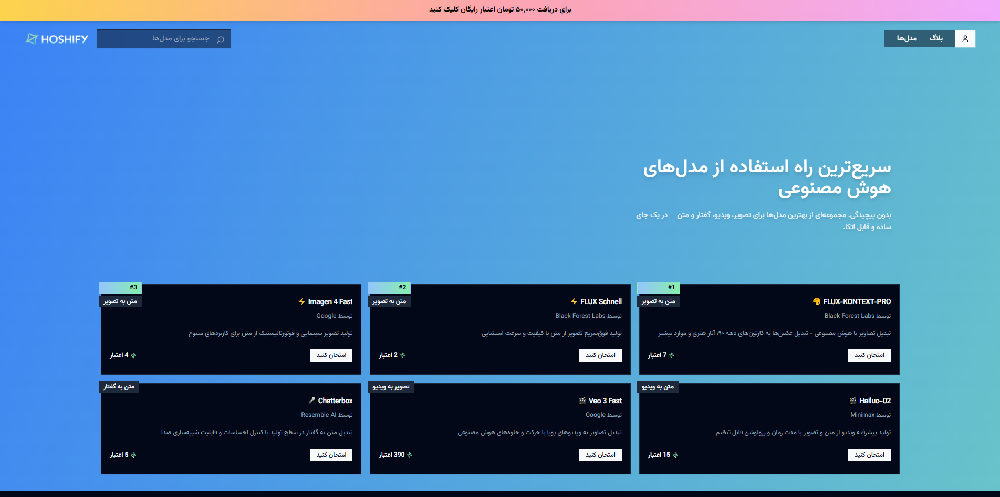
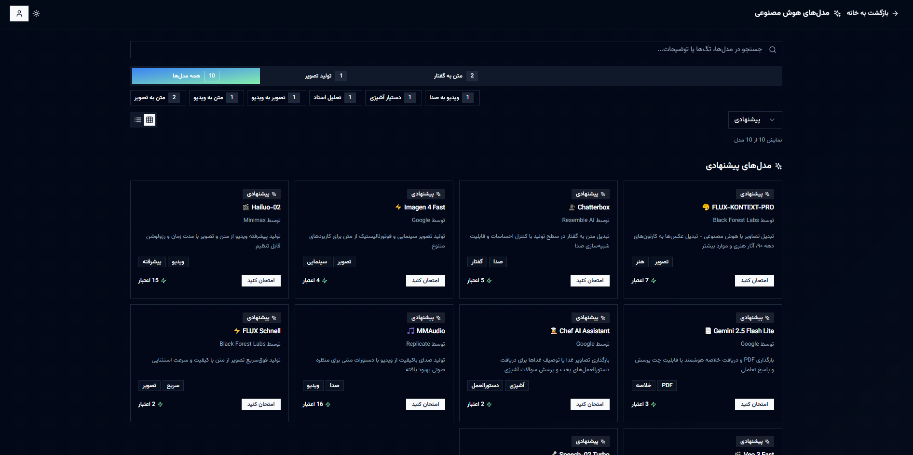
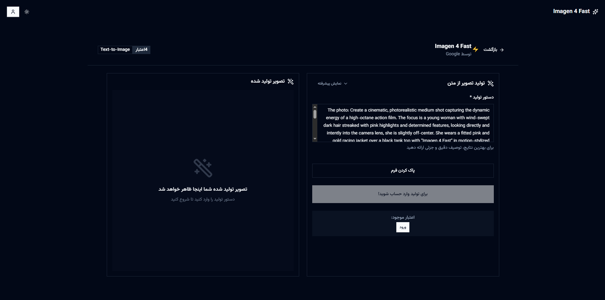

# 🚀 Hoshify (هوشیفای) - AI Platform

> **Team Project by Artin Ebrahim Khani & Mani Mirzaei** - A comprehensive AI platform providing access to AI models for Persian-speaking users

[](https://nextjs.org/)
[](https://www.typescriptlang.org/)
[](https://tailwindcss.com/)
[](https://supabase.com/)

## 📋 Project Overview

Hoshify is a modern, full-stack AI platform that democratizes access to state-of-the-art artificial intelligence models. Built specifically for Persian-speaking users in Iran, it provides a seamless interface to interact with multiple AI services including image generation, video creation, text-to-speech, and document analysis.

## [Production website](https://www.hoshify.com/)

<details>
  <summary>Click here to see the Overview Images</summary>
  <br>
  <p align="center">
    
    
    
  </p>
</details>

**🎯 Key Achievements:**
- **10+ AI Models** integrated from leading providers (Google, Minimax, Black Forest Labs, Replicate)
- **Credit-based system** with secure Iranian payment gateway integration
- **Full RTL support** with Persian localization
- **Real-time processing** with progress tracking and error handling
- **Responsive design** optimized for mobile and desktop

## 🏗️ Architecture & Tech Stack

### Frontend
- **Next.js 14** with App Router and React 18
- **TypeScript** for type safety and better development experience
- **Tailwind CSS** for responsive, utility-first styling
- **Radix UI** components for accessible, customizable UI primitives
- **Lucide React** for consistent iconography

### Backend & Database
- **Supabase** for authentication, database, and real-time features
- **PostgreSQL** with Row Level Security (RLS)
- **Server-side API routes** for AI model integrations
- **BitPay.ir** payment gateway for Iranian Rial transactions

### AI Integrations
- **Google AI** (Imagen 4, Gemini 2.5, Veo 3)
- **Minimax** (Hailuo-02 video, Speech-02 Turbo)
- **Black Forest Labs** (FLUX models)
- **Replicate** (Various open-source models)
- **Resemble AI** (Chatterbox TTS)

## 🌟 Core Features

### 🤖 AI Model Access
- **Text-to-Image Generation**
  - Imagen 4 Fast (Google) - Cinematic quality images
  - FLUX Schnell - Ultra-fast generation
  - FLUX-KONTEXT-PRO - Image transformation

- **Video Generation**
  - Hailuo-02 (Minimax) - Text/image to video
  - Veo 3 Fast (Google) - Advanced video synthesis

- **Text-to-Speech**
  - Speech-02 Turbo (Minimax) - Multilingual with emotion control
  - Chatterbox (Resemble AI) - Voice cloning capabilities

- **Document Analysis**
  - Gemini 2.5 Flash Lite - PDF summarization and Q&A
  - Interactive chat interface for document queries

### 🔐 Authentication & Security
- **Email/Password Authentication** with Supabase Auth
- **OTP Verification** for enhanced security
- **Phone Number Verification** with bonus credit system
- **Session Management** with automatic token refresh
- **Row Level Security** for data protection

### 💳 Payment System
- **BitPay.ir Integration** for Iranian users
- **Credit-based Pricing** with transparent cost structure
- **Real-time Balance Updates** after successful payments
- **Transaction History** and audit logging
- **Secure Payment Flow** with verification callbacks

### 🎨 User Experience
- **Persian RTL Support** with proper text direction
- **Dark/Light Theme** with system preference detection
- **Responsive Design** optimized for all screen sizes
- **Progressive Loading** with skeleton states
- **Error Boundaries** with user-friendly error messages
- **Real-time Progress** tracking for long-running operations

## 🛠️ Technical Implementation

### State Management
```typescript
// Custom hooks for authentication and user management
const { user, isAuthenticated, deductUserCredits, refreshUserImmediate } = useAuth()

// Real-time credit balance updates
const updateUserBalance = (newBalance: number) => {
  setUser(prev => prev ? { ...prev, credit_balance: newBalance } : null)
}
```

### API Integration Pattern
```typescript
// Unified error handling and credit management
const generateContent = async (creditsRequired: number) => {
  try {
    const response = await fetch('/api/generate-content', {
      method: 'POST',
      headers: { 'Content-Type': 'application/json' },
      body: JSON.stringify({ prompt, userId: user?.id })
    })
    
    if (response.ok) {
      await finalizeUsage({ status: 'success', credits: creditsRequired })
      updateUserBalance(newBalance)
    }
  } catch (error) {
    await finalizeUsage({ status: 'failed', credits: 0 })
  }
}
```

### Payment Flow
```typescript
// BitPay.ir integration with proper error handling
const initiatePayment = async (amount: number, credits: number) => {
  const result = await BitpayManager.initiatePayment({
    amount: amount * 10, // Convert Tomans to Rials
    redirect: `${window.location.origin}/payment/callback`,
    description: `خرید ${credits} اعتبار هوشیفای`
  })
  
  if (result.success && result.id_get) {
    window.location.href = BitpayManager.getPaymentUrl(result.id_get)
  }
}
```

## 📱 Features Showcase

### AI Model Interface
- **Dynamic model cards** with real-time popularity ranking
- **Advanced parameter controls** for fine-tuning outputs
- **Progress tracking** with estimated completion times
- **Result sharing** and download capabilities

### User Dashboard
- **Credit balance** monitoring with usage history
- **Recent activity** timeline with output previews
- **Payment history** with transaction details
- **Profile management** with phone verification

### Admin Panel
- **Blog management** with rich text editor
- **User analytics** and usage statistics
- **Model performance** monitoring
- **Payment verification** tools

## 🔧 API Endpoints

### Authentication
- `POST` - User registration
- `POST` - User login
- `POST` - User logout
- `POST` - Sync user profile

### AI Models
- `POST` - Text-to-image generation
- `POST` - Text-to-Video generation
- `POST` - Image-to-Video generation
- `POST` - Text-to-speech
- `POST` - Document analysis

### Payment
- `POST` - Start payment process
- `POST` - Verify payment completion
- `GET` - Payment callback handler

### Analytics
- `GET` - Platform statistics
- `POST` - Log AI model usage

## 🎯 Performance Optimizations

- **Image Optimization** with Next.js Image component
- **Code Splitting** with dynamic imports
- **Caching Strategy** for API responses
- **Database Indexing** for fast queries
- **CDN Integration** for static assets
- **Error Boundaries** for graceful error handling

## 🌐 Internationalization

- **RTL Layout Support** for Persian text
- **Persian Number Formatting** with custom utilities
- **Localized Error Messages** in Persian and English
- **Cultural Adaptations** for Iranian users
- **Currency Formatting** in Tomans and Rials

## 📈 Analytics & Monitoring

- **User Engagement** tracking with custom events
- **AI Model Usage** statistics and trends
- **Payment Success Rates** monitoring
- **Error Rate** tracking and alerting
- **Performance Metrics** with Core Web Vitals

## 🔒 Security Features

- **Input Validation** with Zod schemas
- **SQL Injection Protection** with parameterized queries
- **XSS Prevention** with proper sanitization
- **CSRF Protection** with SameSite cookies
- **Rate Limiting** for API endpoints
- **Audit Logging** for sensitive operations

## 📊 Project Statistics

- **Lines of Code**: ~15,000+ (TypeScript, React, CSS)
- **Components**: 50+ reusable UI components
- **API Routes**: 25+ endpoints
- **Database Tables**: 8 tables with proper relationships
- **AI Models**: 10+ integrated models
- **Supported Languages**: Persian (primary), English

## 🎨 Design System

- **Color Palette**: Custom theme with dark/light variants
- **Typography**: Persian-optimized font stack
- **Spacing**: Consistent 8px grid system
- **Components**: Accessible, keyboard-navigable
- **Animations**: Smooth transitions with reduced motion support

## 🔮 Future Enhancements

- [ ] **Mobile App** (React Native)
- [ ] **API Access** for developers
- [ ] **Bulk Processing** capabilities
- [ ] **Team Collaboration** features
- [ ] **Advanced Analytics** dashboard
- [ ] **More AI Models** integration

## 📄 License

This project is licensed under the MIT License - see the [LICENSE](LICENSE) file for details.

© 2025 Hoshify Co. All rights reserved

## 👨‍💻 About the Developer

This project represents my expertise in:
- **Full-stack development** with modern React/Next.js
- **AI/ML integration** and API management
- **Payment gateway** implementation
- **Database design** and optimization
- **User experience** design for Persian users
- **Security best practices** and data protection

## 📞 Contact Developer

**Artin Ebrahim Khani**
- Email: Artin@prstg.net

**Mani Mirzaei**
- Email: Mani@prstg.net

---

**Note**: This is a team project developed that showcases full-stack development capabilities with AI integration, payment processing, and internationalization for the Iranian market.
